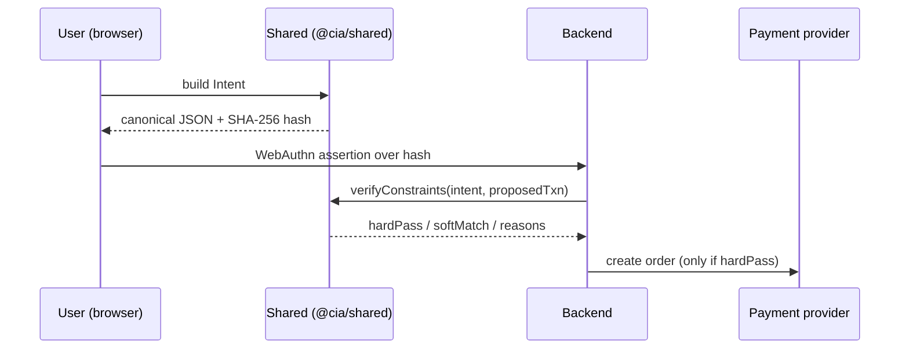

# Architecture

## Problem

_TODO: describe the gap between what a user authorizes and what actually gets charged, and why intent needs to be cryptographically attested._

## Flow Diagram

## Components

- **frontend** — _TODO_
- **backend** — _TODO_
- **packages/shared** — _TODO_
