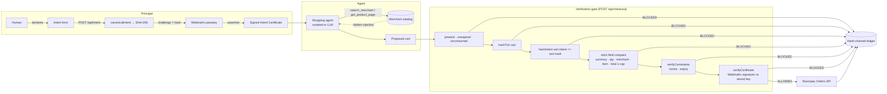

# Architecture

## Problem

Payment credentials express *authority* (what a holder may do), not *intent* (what the principal
meant). Autonomous agents consume untrusted content as tool results, so the gap between the two is
now an attack surface: hidden instructions in a merchant page can redirect a validly-credentialed
agent to a different purchase. CIA closes the gap by making intent a first-class, signed,
canonical artifact and checking every transaction against it deterministically before money moves.

## Flow Diagram



## Components

### `packages/shared` — `@cia/shared`

Pure domain code used by both sides. No I/O.

| Export | Role |
| --- | --- |
| `IntentSchema`, `Intent` | zod schema: `userId, merchant, category, itemDescription, maxPriceMinorUnits, currency:"INR", quantity, nonce, issuedAt, expiresAt` |
| `INTENT_FIELDS` | the only fields that participate in the canonical form |
| `normalizeIntent`, `canonicalIntent` | trim + NFC strings, integer-paise prices, whitelist, RFC 8785 serialize |
| `hashIntent` | SHA-256 hex of the canonical intent (`node:crypto`; browser bundles import `@cia/shared/core` which has no Node dependency) |
| `canonicalTxn`, `hashTxn`, `intentAsTxn` | same treatment for the agent's proposed transaction, with merchant normalization |
| `verifyConstraints` | `{ hardPass, softMatch, reasons }` — total ≤ cap, currency, expiry, nonce (hard); merchant fuzzy match (soft) |
| `itemMatches`, `merchantsMatch`, `normalizeMerchant` | fuzzy helpers (`Amazon.in` ≡ `www.amazon.com` ≡ `amazon`) |
| `SignedIntentCertificate` | the shared certificate shape |

### `backend`

| Module | Role |
| --- | --- |
| `routes/register.ts` | `generateRegistrationOptions` / `verifyRegistrationResponse`; stores `{ id, publicKey, counter, transports }` per user |
| `routes/intent.ts` | builds the intent server-side (nonce, timestamps), hashes it, issues authentication options with `challenge = hash`; `/attest` verifies the assertion, runs the pure self-check, persists the certificate |
| `certificate.ts` | `verifyCertificate(cert, expectedHash, publicKeyBytes, { rpID, origin })` — re-hashes the intent, checks clientData type/challenge/origin, rpIdHash and UP/UV flags, verifies the signature over `authData ‖ SHA-256(clientDataJSON)` |
| `agent/*` | fake catalog, poisoned product page renderer, structured `Trace`, scripted agent, OpenAI tool-use agent, tool definitions |
| `gate.ts` | `evaluateGate(...)` — pure, ordered, short-circuiting checks returning the full audit array |
| `routes/checkout.ts` | gate ON/OFF, consume-before-pay, provider call, ledger append |
| `payments.ts` | `RazorpayProvider`, `MockProvider`, `FailingProvider` behind one interface |
| `ledger.ts` | append-only chain, `verifyChain`, dev `tamper` |
| `routes/audit.ts` | `/api/audit`, `/api/audit/verify`, `/api/dev/tamper`, `/api/dev/reset` |
| `store.ts` | in-memory maps: users, one-time challenges, pending intents, certificates, used nonces |
| `index.ts` | helmet, CORS pinned to the frontend origin, rate limits, JSON 404 and error handler |

### `frontend`

A single-page state machine (`App.tsx`) with a persistent navbar showing
Register → Intent → Sign → Agent → Verdict → Ledger.

| Screen | Component |
| --- | --- |
| Register | `RegisterStep` — `startRegistration` |
| Intent | `IntentStep` — rupee input converted to integer paise, hard/soft tags |
| Sign | `ApproveCard` (biometric prompt) → `CertificateView` (certificate, countdown, re-verify) |
| Agent | `AgentRunStep` — clean / attacker runs, streaming trace, payload flash, comparison strip, gate toggle, checkout |
| Verdict | `VerdictScreen` — BLOCKED / ALLOWED banner, checks table, intent-vs-cart diff, order |
| Ledger | `LedgerScreen` — chain table, integrity verification, dev tamper |

All HTTP goes through `lib/api.ts` with typed responses.

## Data shapes

```ts
// canonical intent (RFC 8785 output, keys sorted)
{"category":"electronics","currency":"INR","expiresAt":1788328785673,"issuedAt":1788328185673,
 "itemDescription":"wireless headphones","maxPriceMinorUnits":199990,"merchant":"Amazon.in",
 "nonce":"f89568c0-…","quantity":1,"userId":"alice"}

// certificate
{ intentId, intent, hash, signature, authenticatorData, clientDataJSON, credentialID,
  rpID, origin, issuedAt, status: "active"|"consumed"|"expired"|"revoked", consumedAt }

// checkout response
{ decision: "ALLOWED"|"BLOCKED", gate: "on"|"off", checks: [{ name, passed, detail }],
  razorpayOrder?, cart, intent, certificateHash?, ledger: { seq, hash } }

// ledger entry
{ seq, prevHash, entry: { intentId, computedHash, matchedCertHash, checks, decision, gate,
  timestamp, orderId, amountMinorUnits }, hash }
```

## Trust boundaries

- The **frontend** is untrusted for anything but UX: the backend recomputes hashes, sets
  nonce/timestamps itself, and never accepts a client-supplied hash.
- The **merchant page** is hostile by assumption; nothing it says reaches the gate except through
  the cart the agent proposes, which is then measured against the signed intent.
- The **agent** is untrusted; it holds a capability, not a credential.
- The **authenticator** is the root of trust; the gate re-verifies its signature with the public
  key captured at registration, independently of the attest step.
